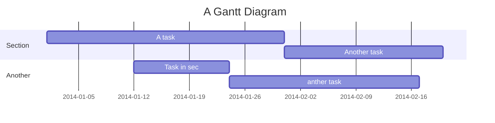
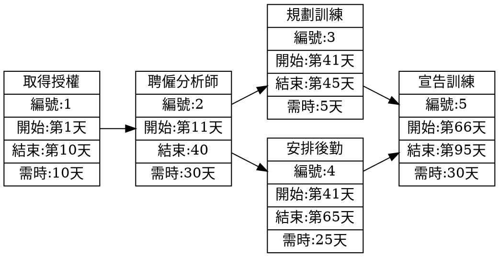

## 專案管理

### 甘特圖

```mermaid
gantt
    title A Gantt Diagram

    section Section
    A task           :a1, 2014-01-01, 30d
    Another task     :after a1  , 20d
    section Another
    Task in sec      :2014-01-12  , 12d
    anther task      : 24d
```

### PERT/CPM圖

```graphviz
digraph {
	node[shape=record];
	rankdir="LR";
    no1 [label = "取得授權 | 編號:1 | 開始:第1天 | 結束:第10天 | 需時:10天"]
    no2 [label = "聘僱分析師 | 編號:2 | 開始:第11天 | 結束:40 | 需時:30天"]
    no1->no2
    no3 [label = "規劃訓練 | 編號:3 | 開始:第41天 | 結束:第45天 | 需時:5天"]
    no4 [label = "安排後勤 | 編號:4 | 開始:第41天 | 結束:第65天 | 需時:25天"]
    {rank=same;no3 no4}
    no2->no3
    no2->no4
    no5 [label = "宣告訓練 | 編號:5 | 開始:第66天 | 結束:第95天 | 需時:30天"]
    no3->no5
    no4->no5
}
```

### 關鍵路徑
